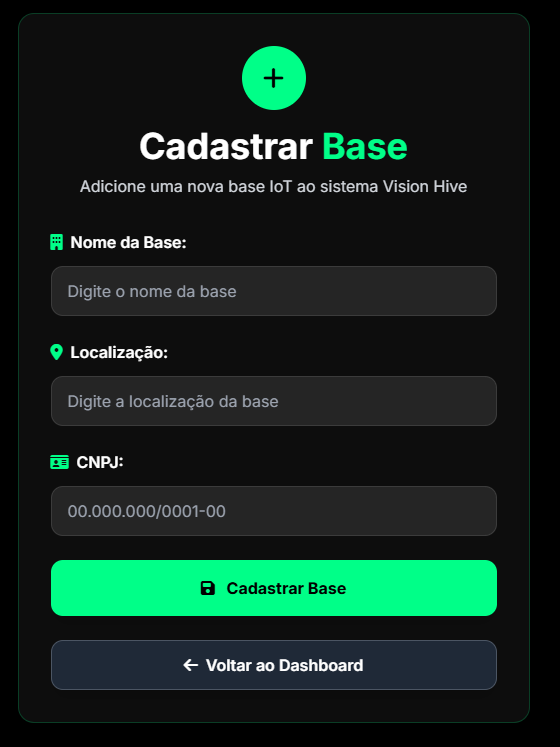
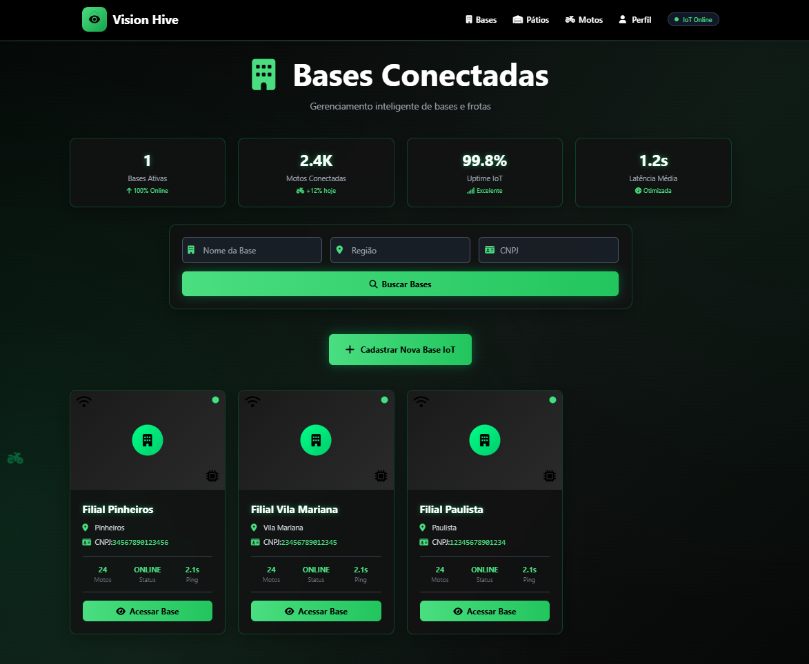
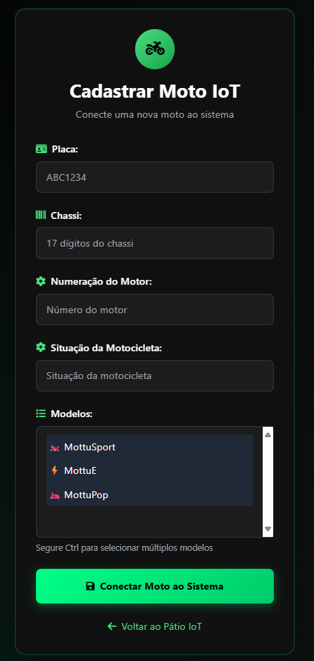
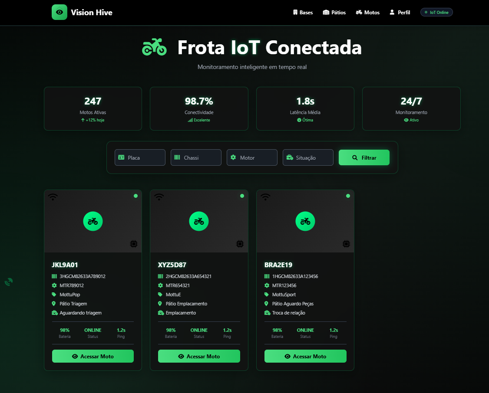
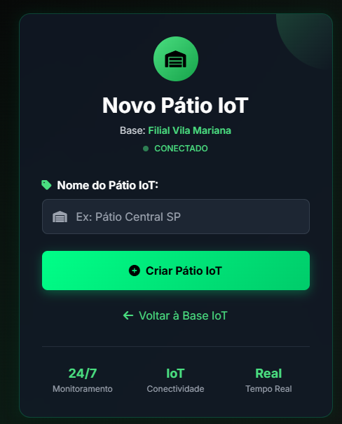
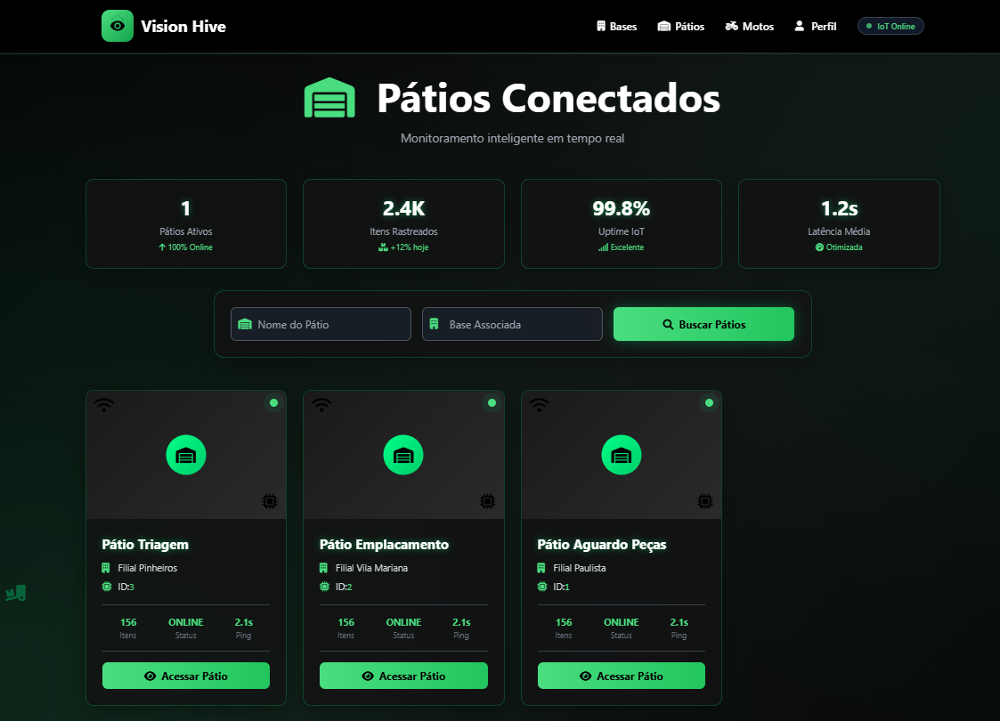

# 🚀 Vision Hive

**Vision Hive** é uma API RESTful desenvolvida para a empresa Mottu com o objetivo de facilitar o gerenciamento e localização de motocicletas nos pátios operacionais. A aplicação permite o cadastro de **Filiais (Branch)**, **Pátios (Patio)** e **Motocicletas (Motorcycle)**, associando motos aos seus respectivos pátios e filiais, com busca por placa, chassi ou número do motor, onde cada moto é gerenciada por um **ESP32**, composto por um buzzer e leds, mostrando exatamente onde está a motocicleta solicitada.

Além disso, o sistema possui **controle de acesso baseado em roles**:
- **ADMIN:** acesso completo a todas as rotas e funcionalidades, incluindo criação de operadores e visualização de todos os links rápidos no footer.
- **OPERADOR:** acesso restrito às rotas de motocicletas (`/motorcycle` e `/motorcycle/{id}`), e ao perfil do usuário. O footer não exibe os links rápidos.

## 📌 Descrição do Projeto

Este projeto tem como objetivo automatizar e otimizar a gestão das motos nos pátios da Mottu utilizando microcontroladores ESP32 conectados via Wi-Fi, sensores físicos e um sistema web responsivo. A proposta visa garantir uma operação mais ágil, segura e escalável, eliminando o controle manual e aumentando a precisão na localização e no monitoramento dos veículos.

## 🎬 DEMONSTRAÇÃO YOUTUBE

[https://youtu.be/-NiaC18WjXQ](https://youtu.be/-NiaC18WjXQ)


## 📡DEPLOY

[http://visionhive.brazilsouth.azurecontainer.io:8080](http://visionhive.brazilsouth.azurecontainer.io:8080)


## 🪪 Login para testes como admin

- Login:
  ```adminCM```
- Senha:
  ```admin123```

## 🪪 Login para testes como operador

- Login:
  ```operadorCM```
- Senha:
  ```operador123```

## 🎯 Objetivos

- Identificar rapidamente uma moto específica no pátio utilizando um alerta visual e/ou sonoro.
- Fornecer uma visualização **em tempo real** da chamada e do status de resposta da moto.
- Garantir escalabilidade para aplicação em mais de 100 filiais com diferentes layouts.
- Oferecer uma interface intuitiva, acessível por desktop e mobile.
- Integrar sensores IoT nas motos para coleta automatizada de dados e status.

## 🚨 Dor da Mottu

Com centenas de motos distribuídas em mais de 100 pátios no Brasil e no México, a Mottu enfrenta dificuldades operacionais para localizar rapidamente veículos específicos, gerando atrasos logísticos e desperdício de tempo da equipe.

## 💡 Nossa Solução

O **VisionHive** propõe o uso de dispositivos **ESP32** com sensores físicos e conexão Wi-Fi, fixados em cada moto. Através de uma **plataforma web integrada**, é possível acionar **alertas visuais ou sonoros remotamente**, permitindo a identificação **precisa e ágil** de qualquer moto no pátio — sem depender de busca manual.

---

## 📸 Imagens do Projeto

### 🏢 Bases  
- **Cadastro de Bases**  
  

- **Bases Cadastradas**  
  

---

### 🛵 Motocicletas  
- **Cadastro de Motos**  
  

- **Motos Cadastradas**  
  

---

### 🅿️ Pátios  
- **Cadastro de Pátios**  
  

- **Pátios Cadastrados**  
  

---

## 🛠 Tecnologias Utilizadas

- Java 17+
- Spring Boot (Web, Data JPA, Validation, Security)
- Banco de Dados H2 (para desenvolvimento)
- Lombok
- Swagger (OpenAPI) para documentação automática
- Maven para gerenciamento de dependências
- Thymeleaf para frontend
- TailwindCSS para estilos
- C++ (Programação do Esp32)
- Deploy azure (pipeline)

---

## 🔐 Controle de Acesso

### ADMIN
- Pode acessar todas as rotas: `/branch`, `/patio`, `/motorcycle`.
- Pode criar operadores.
- Footer exibe todos os links rápidos.
- Botão de "Voltar" em formulários redireciona para `/`.

### OPERADOR
- Acesso restrito a `/motorcycle` e `/motorcycle/{id}`.
- Footer não exibe links rápidos.
- Botão de "Voltar" em formulários redireciona para `/motorcycle`.

---

## 🚀 Como Rodar o Projeto

# Deploy
```text
http://visionhive.brazilsouth.azurecontainer.io:8080/
```

# Local (Porém o azure irá bloquear o seu ip, então acesse o deploy)

1. Clone o repositório:
   ```bash
   git clone https://github.com/seu-usuario/visionhive.git
   ```

2. Entre na pasta do projeto:
   ```bash
   cd VisionHive-Java
   ```
   
3. Execute a aplicação:
   ```bash
   ./mvnw spring-boot:run
   ```

4. Acesse a aplicação via navegador web:
   ```
   http://localhost:8080/login
   ```

6. Acesse a documentação Swagger para testar as rotas:
   ```
   http://localhost:8080/swagger-ui/index.html
   ```

---

## 👥 Integrantes

| Nome                   | RM       |
|------------------------|----------|
| João Victor Michaeli   | RM555678 |
| Larissa Muniz          | RM557197 |
| Henrique Garcia        | RM558062 |
